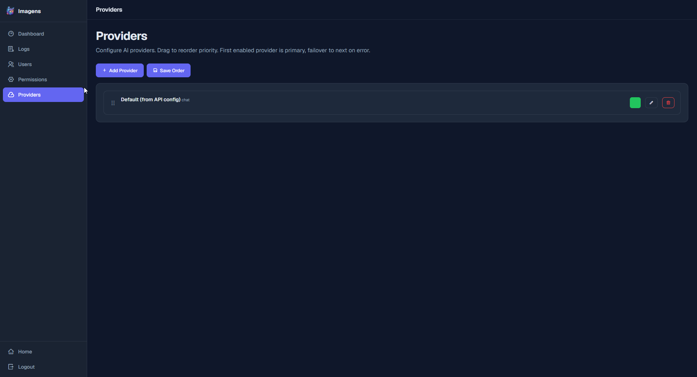

# Imagens

[](LICENSE)
[](https://github.com/salnart/imagens)

A self-hosted AI image generation platform with multi-provider failover, user management, and an intuitive admin panel. Deploy with Docker.

<p align="center">
  
  
  <br>
  
  
  <br>
  
  
</p>

---

## Features

- **Preset-Based Multi-Provider AI** — Configure any OpenAI-compatible API using presets (*OpenAI Standard, Chat Completion, Google AI Studio, Evolink Async, Custom*) with automatic failover.
- **Strict Failover System** — Generates strictly through the drag-and-drop provider order configured in the admin panel.
- **Fast Performance** — Optimized database logging queries (excluding heavy base64 references in list views) for instant Dashboard and Logs tab loading.
- **Detailed JSON API Logging** — Complete API request and response JSON payloads are logged weekly with automatic 3-month rotation and cleanup.
- **User Management** — Registration, credits system, per-user UI configuration, and WeChat/Email contact settings.
- **Admin Panel** — Modern sidebar-based dark theme interface containing Dashboard, Logs, Users, Permissions, and Providers tabs.
- **Image Generation** — Text-to-image, reference images (stored as base64), batch generation (up to 4).
- **Unlimited Mode** — Per-user and global unlimited generation options.
- **24-Hour Time Format** — Universal 24h clock displays (`hour12: false`) across the entire user and admin interface.
- **Docker** — One-command deployment with optimized context building (`.dockerignore`) and automatic space pruning.

---

## Quick Start

### Prerequisites

- Docker and Docker Compose installed
- An AI API key (OpenAI, Google AI Studio, or any OpenAI-compatible provider)

### 1. Clone and Configure

```bash
git clone https://github.com/YOUR_USERNAME/imagens.git
cd imagens
cp .env.example .env
```

Edit `.env` — at minimum set `MYSQL_PASSWORD` to a secure password, and configure your AI provider:

```env
# Database (required)
MYSQL_PASSWORD=your_secure_password
```

### 2. Deploy

```bash
chmod +x deploy.sh
./deploy.sh
```

Or manually:

```bash
docker compose build app --no-cache
docker compose up -d
```

### 3. First Run

1. Open http://localhost:3000
2. Register — **the first registered user becomes admin**
3. Configure additional AI providers in the admin panel → Providers tab
4. Add users via admin panel → User Management

---

## Admin Panel

Access: http://localhost:3000/admin (or click "Admin" in top nav)

| Tab | Description |
|-----|-------------|
| Dashboard | Stats and recent activity |
| Logs | Generation audit logs with filters |
| Users | User management (credits, unlimited, config) |
| Permissions | Global settings and UI config |
| Providers | AI provider preset management with drag & drop priority |

---

## API Endpoints

| Method | Path | Description |
|--------|------|-------------|
| GET | `/api/auth/me` | Current user + public settings |
| POST | `/api/auth/register` | Register (first user = admin) |
| POST | `/api/auth/login` | Login |
| POST | `/api/images/generate` | Generate image |
| GET | `/api/images/history` | User's generation history |
| GET | `/api/admin/settings` | Admin settings (admin only) |
| PATCH | `/api/admin/settings` | Update settings (admin only) |
| GET | `/api/admin/users` | User list (admin only) |
| GET | `/api/admin/generations` | Generation logs (admin only) |
| POST | `/api/admin/providers/test` | Test provider connectivity on server-side |

---

## Environment Variables

| Variable | Default | Description |
|----------|---------|-------------|
| `PORT` | `3000` | Server port |
| `MYSQL_HOST` | `mysql` | MySQL host (Docker service name) |
| `MYSQL_PASSWORD` | — | MySQL root password **(required)** |
| `MYSQL_DATABASE` | `gpt_image_studio` | Database name |
| `DEFAULT_CREDITS` | `10` | Sign-up credits |
| `GENERATION_CREDIT_COST` | `1` | Credits per image |
| `CHECKIN_CREDIT` | `1` | Daily checkin credit |
| `ALLOW_REGISTRATION` | `true` | Allow user registration |
| `MAX_IMAGES_PER_REQUEST` | `4` | Max batch size |
| `ADMIN_EMAIL` | — | Pre-create admin on first start |
| `ADMIN_PASSWORD` | — | Admin password (with ADMIN_EMAIL) |

---

## Provider Preset Configuration

In the admin panel → Providers, add any supported preset:

| Preset | Base URL | Model |
|----------|----------|-------|
| OpenAI Standard | `https://api.openai.com/v1` | `dall-e-3` |
| Chat Completion | `https://api.openai.com/v1` | `gpt-4o` |
| Google AI Studio | `https://generativelanguage.googleapis.com/v1beta/openai/` | `gemini-2.0-flash-exp-image-generation` |
| Evolink Async | `https://api.evolink.ai/v1/images/generations` | `gemini-3.1-flash-image-preview` |
| Custom Settings | Any custom provider | Custom configurations |

Providers are tried in order — if the first fails, the next is used (failover).

---

## Project Structure

```
├── server.js              # Main server
├── src/
│   └── mysql-store.js     # Database layer
├── public/
│   ├── index.html         # Main page
│   ├── app.js             # Frontend app
│   ├── admin.html         # Admin panel
│   ├── admin.js           # Admin logic
│   └── admin.css          # Admin styles
├── database/
│   └── schema.sql         # Database schema
├── Dockerfile
├── docker-compose.yml
├── .env.example
├── .dockerignore
└── deploy.sh
```

---

## Security

- API keys are **never sent to clients**. Masked keys (`sk-123***456`) are sent to the admin client.
- Full provider details (with keys) are only available via `/api/admin/settings` (admin-only endpoint) and are secured on the server.
- CSRF protection with Double Submit Cookie pattern.
- Session cookies are HttpOnly, SameSite=Strict.
- Rate limiting on login attempts and API calls.

---

## License

MIT

---

## Credits

- **Original engine:** [image2creat](https://github.com/dk56dd/image2creat) by dk56dd
- **Image Editor:** [Filerobot](https://github.com/scaleflex/filerobot-image-editor) by Scaleflex

---

## 🇷🇺 Русская версия

Imagens — self-hosted веб-приложение для генерации изображений через AI API.

### Быстрый старт

```bash
cp .env.example .env
# Отредактируйте .env — укажите MYSQL_PASSWORD
chmod +x deploy.sh
./deploy.sh
```

Откройте http://localhost:3000, зарегистрируйтесь — **первый зарегистрировавшийся пользователь становится администратором**.

### Возможности

- Поддержка нескольких AI-провайдеров через пресеты (*OpenAI, Chat, Google AI Studio, Evolink Async, Custom*)
- Строгий failover с переходом по списку сверху-вниз
- Быстрая загрузка вкладок логов и дашборда (исключены тяжелые base64 данные из списков)
- Еженедельное ротируемое JSON-логирование запросов/ответов с автоочисткой за 3 месяца
- Система кредитов, ежедневный чекин и гибкое управление пользователями
- Админ-панель: дашборд, логи, провайдеры, пользователи
- Генерация по тексту и референсным изображениям
- Unlimited режим (глобальный и для каждого пользователя)
- 24-часовой формат времени во всем приложении
- Сборка и деплой через Docker за несколько секунд с очисткой кэша
